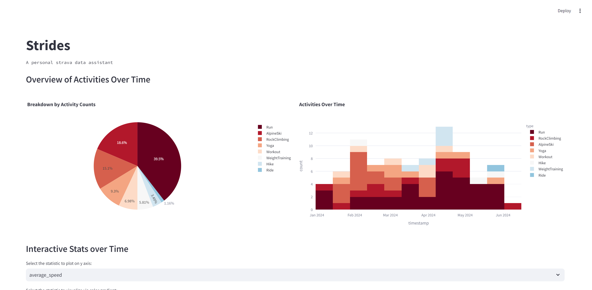
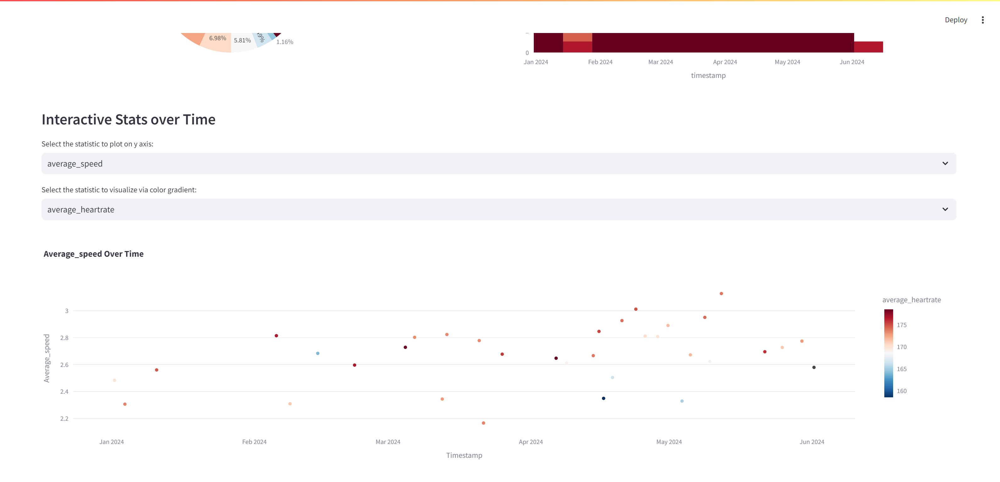

# Strava Activity Analysis and Chat with DataFrame

## Overview

This Streamlit app allows you to analyze activities and trends using structured Strava data that has been previously collected. It provides various visualizations of your activities, including statistics like speed, heartrate, distance, and elevation over time. Additionally, the app includes a chat feature that lets you interact with the DataFrame to extract insights and perform custom queries.

## Features

- **Activity Visualization**: Visualize statistics such as speed, heartrate, distance, and elevation over time.
- **Interactive Plots**: Switch between different statistics using a dropdown menu.
- **Data Chat**: Interact with your data using natural language queries to gain insights and perform custom analysis.

## Setup

To run this app locally, follow these steps:

1. Clone the repository:
    ```bash
    git clone https://github.com/yourusername/strava-analysis-app.git
    cd strava-analysis-app
    ```

2. Install the required dependencies:
    ```bash
    pip install -r requirements.txt
    ```

3. Add .env file with your OpenAI token
    ```
    OPENAI_TOKEN = '<your_token_here>'
    ```

4. Download your personal strava data and convert from json to csv with the following columns:
- `start_date_local`: Date and time of the activity
- `type`: Type of activity (e.g., running, cycling)
- `average_speed`: Speed during the activity
- `average_heartrate`: Heartrate during the activity
- `distance`: Distance covered in the activity
- `total_elevation_gain`: Elevation gain during the activity

Place this CSV file in the same directory as the app or provide the path to the file when prompted by the app.
Integration of Strava API is work in progress.

5. Run the Streamlit app:
    ```bash
    streamlit run strides.py
    ```

## Usage

### Overview Plots




### Interactive Plots

1. **Launch the App**: Run the Streamlit app using the command mentioned above.
2. **Select a Statistic**: Use the dropdown menu to select which statistic you want to visualize (e.g., speed, heartrate, distance, elevation).
3. **View the Plot**: The selected statistic will be plotted over time, split by activity type.




### Data Chat

**Interact with the DataFrame**: Use the chat interface to ask questions about your data. Examples of queries include:
   - "Show me the average speed of all activities."
   - "What was the maximum heartrate recorded?"
   - "List all activities with elevation gain greater than 500 meters."

[Example chat with dataframe](demo/StridesChatDemo.mp4)
